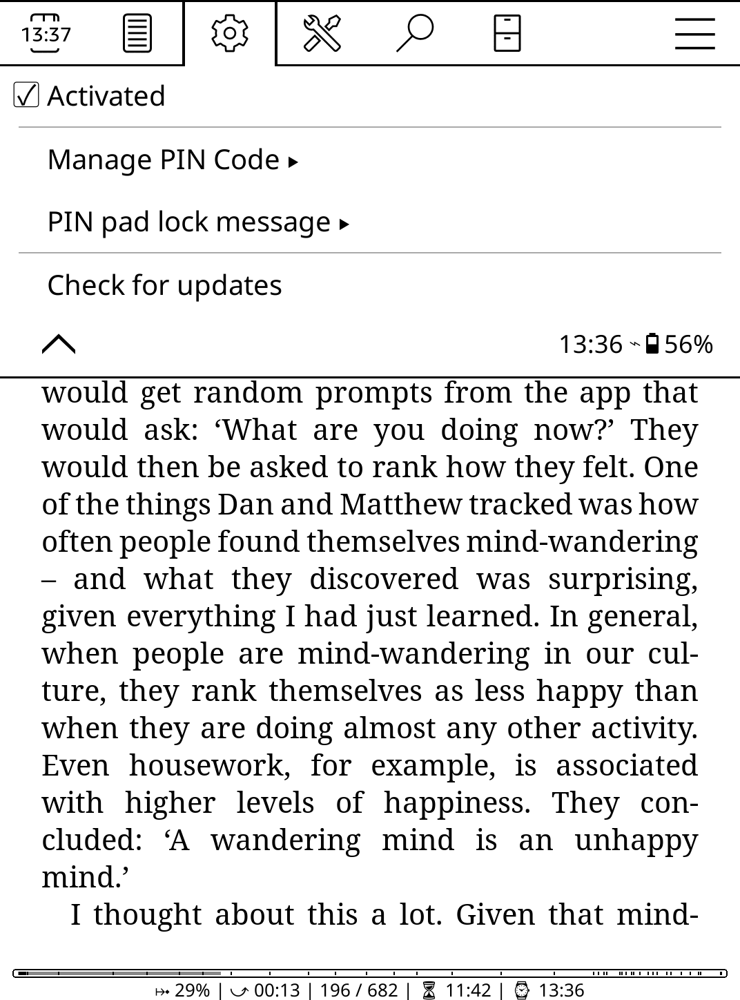

# pinpad_screenlock_plugin

A small plugin to enable locking the screen of KOReader with a PIN code.

This work was originally based on the work of yogi81 and their plugin `screenlock_koreader_plugin`.

## Setup

1. Put `pinpadlockscreen.koplugin` into the `koreader/plugins` directory.
2. Put `lock.svg` or your own icon (with this specific name) into the `koreader/resources/icons/mdlight` directory.
3. Activate and change your password through the menu in Settings -> Screen -> PIN Pad Lock.
The default code is "1234". You can also add a custom message to display with the pin pad (e.g. contact details) and change its position and text alignment. You can also jump lines using "\n" in the message.

**Note:** There's no limit to the number of digits your code may contain, but good luck if you forget your code (you'll have to dig into your memory or KOReader to find it back).

## Features and Gestures

* `Manage PIN Code`:
  * `Change PIN Code` will allow you to change your code after entering your current one.
  * `Reset PIN Code` will reset the code at `1234`.

* `PIN pad lock message` allows you to manage the custom message you can add to the PIN Pad. This is optional.

* `Cancel` button: a quick tap will delete a digit of the code you entered, a long hold will delete every digits.

* You have three tries before the device is locked for 30 seconds and you can not interact with it.

* The pad will appear based on the current screensaver setting you're using.

* Check for updates directly from your device, without having to open GitHub. This feature needs the device to be connected to Internet.

## Future work

* When launching KOReader (on a jailbroken kindle), PIN Pad does not appear right away, leaving the possibility to deactivate or reset the lock.

**Note:** I do not know when I'll be implementing these features. Also, my work could probably be optimized so I'm open to any new ideas and remarks.

## Recent Features

* Customizable message on PIN pad lock.
* Menu Entry where everything is customizable without the need to restart KOReader or modify the code.
* Using dynamic persistence instead of hardcoded variables.
* Cancel button deletes one digits when entering PIN Code, hold it to delete everything.
* 3 tries limit before a 30 seconds timeout.
* PIN Pad appears on the screensaver background (without sleep message)

:)
